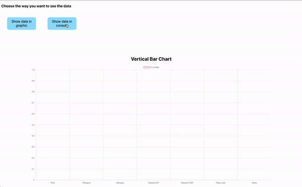

# Vertical bar with data

Receiving data from an API and preview it as vertical bar. 
I'm using nodejs & express for my local server.
Date are saved in a .txt file.

First of all install all npm packages on react project but on server as well, then go into server node files/ and start the local server with "node index.js".
Then start the react app.

Columns have different date, it's about dates, about total hosts, total GET request, total POST request etc.
You can hover over and see the total number of every category.

There is an extra button that you can click and see all the data in console, for developer purposes.

